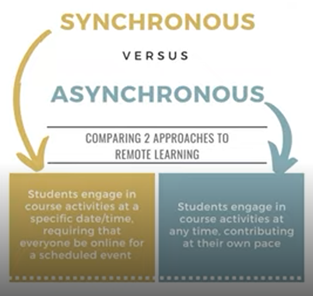
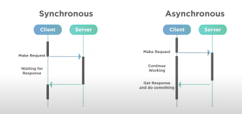
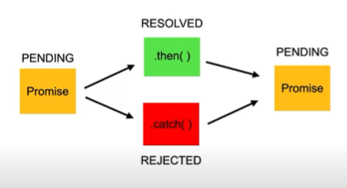
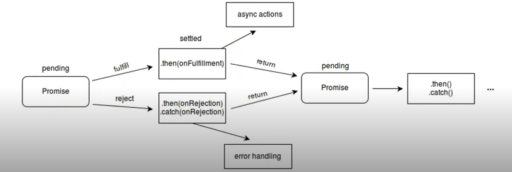
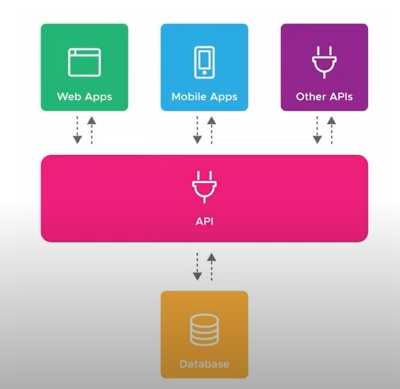

# Assincronicidade

## Definição
**Assíncrono** é algo que não ocorre ou não se efetiva ao mesmo tempo



O javascript roda de maneira síncrona



## Promises
Objeto de processamento assíncrono



Inicialmente, seu valor é desconhecido. Ela pode, então, ser **resolvida** ou **rejeitada**

Uma Promise pode ter três estados:
1. Pending
2. Fulfilled
3. Rejected



### Estrutura

``` Javascript
const myPromise = new Promise((resolve, reject) => {
    window.setTimeout(() => {
        resolve(console.log('Resolvida!'));
    }, 2000);
});
```

### Manipulação
``` Javascript
const myPromise = new Promise((resolve, reject) => {
    window.setTimeout(() => {
        resolve('Resolvida!');
    }, 2000);
});

await myPromise
    .then((result) => result + ' passando pelo then')
    .then((result) => result + ' e agora acabou!')
    .catch((err) => console.log(err.message));

// Após 2 segundos, retornará o valor
// "Resolvida passando pelo then e agora acabou!"
```

## Async/await
Funções assíncronas precisam dessas duas palavras chave.
``` Javascript
async function resolvePromise() {
    const myPromise = new Promise((resolve, reject) => {
        window.setTimeout(() => {
            resolve('Resolvida!')
        }, 3000);
    });

    const resolved = await myPromise
        .then((result) => result + ' passando pelo then')
        .then((result) => result + ' e agora acabou!')
        .catch((err) => console.log(err.message));

    return resolved;
}
```

# Consumindo APIs

## O que são APIs
Application Programming Interface



Uma API é uma forma de intermediar os resultados do back-end com o que é apresentado no front-end.

Você consegue acessá-la por meio de URLs

### JSON: Javascript Object Notaion

``` JSON
{
    "description": "schena POST bank",
    "type": "object",
    "properties": {
        "id": {
            "type": "number",
            "minimum": 0
        },
        "code": {
            "type": "string"
        },
        "name": {
            "type": "string"
        }
    }
}
```

É muito comum que APIs retornem seus dados no formato .json, portanto precisamos tratar esses dados quando os recebermos.

## Fetch

``` Javascript
fetch(url, options)
    .then(response => response.json())
    .then(json => console.log(json))
// retorna uma promise
```

### Operações no banco (POST, GET, PUT, DELETE, etc)
``` Javascript
fetch('https://endereco-api.com/', {
    method: 'GET',
    cache: 'no-cache',
})
    .then(response => response.json())
    .then(json => console.log(json))

////////////////////////////////////////

fetch('https://endereco-api.com/', {
    method: 'POST',
    cache: 'no-cache',
    body: JSON.stringify(data)
})
    .then(response => response.json())
    .then(json => console.log(json))
```