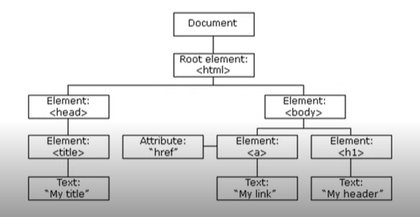
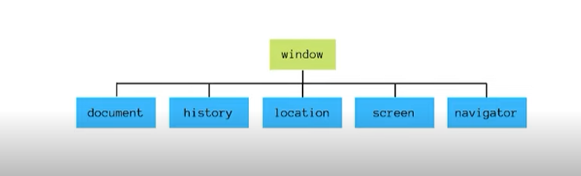

# Entendendo o DOM

## O que é
### Document Object Model

    
O DOM HTML é um padrão de como acessar e modificar os elementos HTML de uma página

## DOM vs BOM

### **BOM:** Browser Object Model


Tudo o que está dentro do objeto window, inclusive o DOM

# Selecionando Elementos

## Métodos

### Selecionando elementos de uma página

``` HTML
<html>
    <head>
        <title>Minha Página</title>
    </head>

    <body>
        <h1 id="titulo">Minha Página</h1>

        <section class= "textos">
            <h2>Sobre Mim</h2>
            <p>Texto sobre a pessoa aqui.</p>
        </section>
        
        <section class= "textos">
            <h2>Meus Projetos</h2>
            <ul>
                <li>Projeto 1</li>
                <li>Projeto 2</li>
                <li>Projeto 3</li>
            </ul>
        </section>
    </body>
</html>
```

``` Javascript

document.getElementById('titulo');
// <h1 id="titulo">Minha Página</h1>

document.getElementsByTagName('li');
/*
[
    <li>Projeto 1</li>,
    <li>Projeto 2</li>,
    <li>Projeto 3</li>
]
*/

document.getElementsByClassName('textos');
/*
[
    <section class= "textos">
        <h2>Sobre Mim</h2>
        <p>Texto sobre a pessoa aqui.</p>
    </section>,
        
    <section class= "textos">
        <h2>Meus Projetos</h2>
        <ul>
            <li>Projeto 1</li>
            <li>Projeto 2</li>
            <li>Projeto 3</li>
        </ul>
    </section>
]
*/
```

---

``` HTML
<html>
    <head>
        <title>Exemplo querySelectorAll</title>
    </head>

    <body>
        <div class="primeira-classe segunda-classe">
            <ul>
                <li class="opcao">opcao 1</li>
                <li class="opcao">opcao 2</li>
                <li class="opcao">opcao 3</li>
            </ul>
        </div>
    </body>
</html>
```

``` Javascript
document.querySelectorAll('.primeira-classe .segunda-classe');
/*
[
    <div class="primeira-classe segunda-classe">
        <ul>
            <li class="opcao">opcao 1</li>
            <li class="opcao">opcao 2</li>
            <li class="opcao">opcao 3</li>
        </ul>
    </div>
]
*/

document.querySelectorAll('li .opcao');
/*
[
    <li class="opcao">opcao 1</li>,
    <li class="opcao">opcao 2</li>,
    <li class="opcao">opcao 3</li>
]
*/
``` 

### Adicionar e Deletar

| Método | Descrição |
| ----------- | ----------- |
| document.createElement(element) | Cria um novo elemento HTML |
| document.removeChild(element) | Remove um elemento |
| document.appendChild(element) | Adiciona um elemento |
| document.replaceChild(new, old) | Substitui um elemento |

# Trabalhando com Estilos

## Classes
Element.classList

``` HTML
<div id="meu-elemento" class="classe">
    <!-- resto do código aqui -->
</div>
```

``` Javascript
const meuElemento = document.getElementById("meu-elemento");
meuElemento.classList.add("novo-estilo"); // adiciona a classe "novo-estilo"
meuElemento.classList.remove("classe"); // remove a classe "classe"
meuElemento.classList.toggle("dark-mode"); // adiciona a classe "dark-mode" caso ela não faça
// parte da lista e remove ela caso faça.
```

## CSS
Acessando diretamente o CSS de um elemento

``` Javascript
document.getElementsByTagName('p').style.color = 'blue';
```

# Eventos

## Tipos

- Eventos do Mouse
    - mouseover
    - mouseout
- Eventos de clique
    - click
    - dbclick
- Eventos de atualização
    - Change
    - Load

## Acionando Eventos

### Event Listener
Diretamente no Javascript, cria um evento que vai ser acionado no momento em que o usuário realizar determinada ação

``` Javascript
const botao = document.getElementById('meu-botao');
botao.addEventListener('click', outraFuncao);
```

### Atributo HTML
Especifica a função a ser chamada diretamente no HTML

``` HTML
<html>
    <body>
        <h1 onclick="mudaTexto(this)">Clique Aqui!</h1>

        <script>
            function mudaTexto(id) {
                id.innerHTML = "Mudei!";
            }
        </script>
    </body>
</html>
``` 