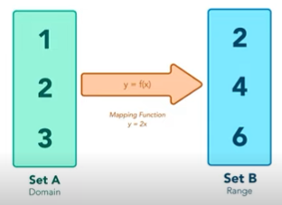
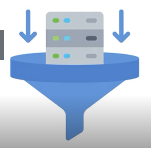
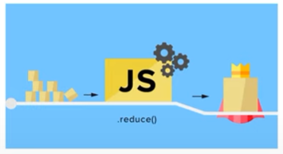

# Map

## O que é 


- Cria um novo array
- Não modifica o array original
- Realiza as operações em ordem

## Sintaxe

``` Javascript
array.map(callback, thisArg);
```
- *Callback:* função a ser executada em cada elemento

        `callback(item, index, array)`

- *thisArg (opcional):* valor de this dentro da função de callback

## Map vs ForEach

``` Javascript
// Usando map
const array = [1, 2, 3, 4, 5];
array.map((item) => item * 2); // retorno: [2, 4, 6, 8, 10];

// Usando forEach
const array = [1, 2, 3, 4, 5];
array.forEach((item) => item * 2) // retorno: undefined
```

- Valor de retorno
- Considere se o array auxiliar será necessário

# Filter

## O que é



- Cria um novo array
- Não modifica o array original

## Sintaxe

``` Javascript
array.filter(callback, thisArg);
```

- *Callback:* função a ser executada em cada elemento (preferencialmente, deve retornar um valor booleano)
- *thisArg:* (opcional) valor de this dentro da função de callback

## Exemplo

``` Javascript
const frutas = ['maçã fuji', 'maçã verde', 'laranja', 'abacaxi'];
const macas = frutas.filter((fruta) => fruta.includes('maçã'));
// macas = ['maçã fuji', 'maçã verde'];
```

# Reduce

## O que é



- Executa uma função em todos os elementos do array, retornando um valor único

## Sintaxe

``` Javascript
array.reduce(callbackFn, initialValue);
```

- *CallbackFn:* função a ser executada a partir do acumulador
    ``` Javascript
    const callbackFn = function(accumulator, currentValue, index, array) {
        // do something
    }
    ```
    - *Accumulator/prevValue:* acumulador de todas as chamadas de callbackFn
    - *currentValue:* elemento atual sendo acessado pela função
- *initialValue:* (opcional) valor sobre o qual o retorno final irá atuar

