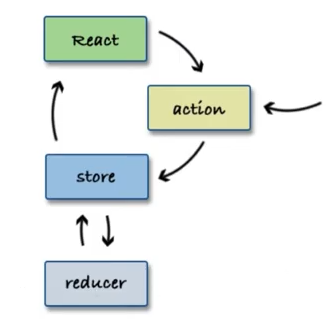
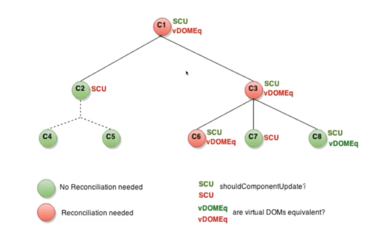
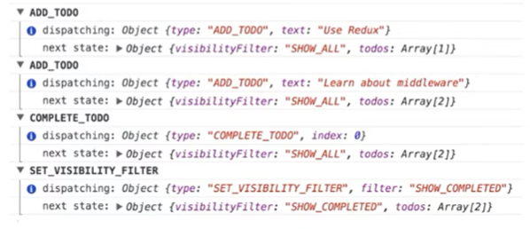
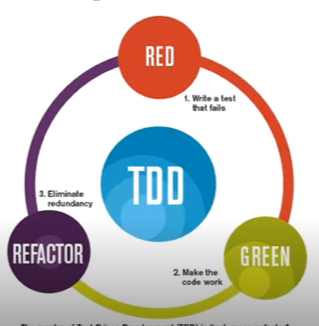

# Trabalhando com estilos em elementos e componentes

## Estilização de componentes e elementos CSS
### Maneiras de estilização
- Inline
    
    ```JSX
    const divStyle = {
        color: 'blue',
        backgroundImage: 'url(' + imgUrl + ')'
    };
    function HelloWorldComponent() {
        return <div style={divStyle}>hello world</div>
    }
    ```
    ---
    ```JSX
    function App() {
        return (
            <HelloWorld style={{marginTop: '10px'}} />
        )
    }
    ```
    - Prós
        - Maneira mais prática e direta
        - Ajustes rápidos
        - Testes de estilo
    - Contras
        - Difícil manutenção
- Classes

    ```CSS
    .div-style {
        color: blue;
        background-color: url('https://bit.ly/2Ç19xk');
    }
    ```
    ```JS
    import './HelloWorldComponent.css';
    function HelloWorldComponent() {
        return <div className="div-style">Hello World!</div>
    }
    ```
    - Em JSX, define-se classes pelo atributo className
        - Maneira mais prática e direta
    - Contras
        - Difícil manutenção
        - Pouca flexibilidade
        - Conflitos com nomes

- CSS in JS
    ```JS
    const DivStyle = styled.div`
        color: blue;
        background: url('${props => props.imageUrl}')
    `;

    function HelloWorldComponent() {
        const url = 'https://bit.ly/2xaK2s1';
        return <DivStyle imageUrl={url}>Hello World</DivStyle>;
    }
    ```
    - Instalação: `npm install --save styled-components`
    - Prós
        - Manutenção
            - Facilidade para remover CSS
            - Estilos dinâmicos
        - Performance
        - Injeção automática de prefixos vendor

## Statefull vs Stateless

- Statefull: usa estados
    - Possui gerenciamento de estados no componente
    - Construídos usando classes em JS
- Stateless: não usa estados
    - Não possui gerenciamento de estados no componente
    - Construídos usando funções em JS

---
- A nomeclatura foi atualizada
    - Class components
    - Function components
- Com hooks, estados são manipuláveis em function components!

## Formulários
Formulários mantém um estado interno
``` HTML
<form>
    <label>
        Nome:
        <input type="text" name="nome" />
    </label>
    <input type="submit" value="Enviar" />
</form>
```
- Em HTML, `<input>, <textarea> e <select>` têm um estado interno
- Em React, podemos controlar o estado
    - state
    - setState

### Componente controlado 
- Tanto select, input ou textarea aceitam um atributo value
- Podemos mudar esse valor usando o atributo onChange
- Ex. `SorveteForm.jsx, NameForm.jsx`

### Componente não-controlado
- A tag input é read-only
- Ex. `FileInput.jsx`

### Bibliotecas
- Formik
- Redux-forms

---
# Introdução ao Redux e fluxos da arquitetura com ReactJS
## Introdução ao Flux   
Flux é um padrão de projeto para tráfego de dados de maneira unidirecional
- Flux/stores são utilizadas apenas para informações que devem ser compartilhados para outros componentes

### Arquitetura Flux

- Action: é como um telégrafo, ele formata a mensagem a ser enviada
- Dispatcher: é como um telefonista, ele sabe todos os callbacks para diferentes Stores
- Store: é como um gerente super controlador, ela guarda a informação e todas as alterações têm que ser feitas por ela mesma, mais ninguém
- View: é como um gerente intermediário (middleware) que recebe as notificações da store e passa os dados para as visões abaixo dela. **Não confundir com a tela em si**.

### Diversas implementações
- Redux (mais popular)
- Reflux
- Mobx
- Vuex (baseado em Redux e Elm) - Vue
- NgRx/store (baseada em Redux e RxJS) - Angular

#### Bibliotecas baseadas em Flux
- Servem para comunicação entre componentes
- Centralizam a informação
- "Flux libraries are like glasses: you'll know when you need them" - Dan Abramov

## O que é Redux
- Criado pro Dan Abramov e Andrew Clarck em 2015
- Redux é uma implementação de Flux
    - Possui algumas diferenças



- Dispatcher não existe mais
- Camada view se chama agora React, por estarmos trabalhando com ele
- Reducer

### 3 Princípios
1. Single source of truth: Uma única store
2. State é read-only
3. Mudanças são feitas com pure functions

### Actions
Em Redux,
- Actions são como o Flux
- Difereça: Actions não enviam o action em si para o dispatcher
- Retornam um objeto de action formatado

### Store
- Em Flux: diversas Stores
- Em Redux: uma única Store
- A Store aqui cuida de toda a árvore de estados
- Os reducers que cuidam de descobrir qual estado muda

### Reducers
- Em Redux não há dispatcher (simplifica e divide o trabalho da Store)
- A Store se conecta ao root reducer, que divide os estados em pequenas reducers para descobrir como lidar com esse estado
- Os estados aqui são imutáveis

### Views
Em React, adiciona na camada de View 3 novos conceitos para conectar a View à Store
1. Provider
2. connect()
3. selector

## Instalando o Redux
```bash
npm install react-redux
npm install --save-dev redux-devtools
```

# Comunicação avançada entre aplicações

## Rest HTTP com React
### APIs HTTP
- Servem para conectar a um ou mais servidores HTTP
    - GET
    - POST
    - DELETE
    - PUT / PATCH
- Fetch API
- Axios

### Fetch API
- Nativa do browser
- Oferece um alternativa ao XMLHttpRequest() e jQuery.ajax()
- Suporte a Service Workers
- Algumas diferenças:
    - Não envia nem recebe cookies (precisa definir a opção credentials)
    - Não rejeita o status do erro HTTP

- GET
```JS
fetch('https://react-intermediario-dio.free.beeceptor.com/cientistas-brasileiras')
    .then(response => response.json())
    .then(data => {
        alert(`Conheça algumas cientistas brasileiras: ${data}`);
    })
    .catch(error => {
        alert('Ops! erro a seguir: ' + error);
    });
```
- POST
```JS
const novaCientista = {nome: 'Fulana de Tal', area: 'Letras'};
fetch('https://react-intermediario-dio.free.beeceptor.com/cientistas-brasileiras', {
    method: 'post',
    body: JSON.stringify(novaCientista)
})
    .then(response => response.json())
    .then(data => {
        alert(`Conheça algumas cientistas brasileiras: ${data}`);
    })
    .catch(error => {
        alert('Ops! erro a seguir: ' + error);
    });
```
- DELETE 
```JS
let index = 4;
fetch(`https://react-intermediario-dio.free.beeceptor.com/cientistas-brasileiras/${index}`, {
    method: 'delete'
})
    .then(response => response.json())
    .then(data => {
        alert(`Conheça algumas cientistas brasileiras: ${data}`);
    })
    .catch(err => {
        alert('Opa! erro a seguir: ' + err);
    });
```
- PUT
```JS
let index = 3;
const novaCientista = {nome: 'Carla', area: 'Física'}
fetch(`https://react-intermediario-dio.free.beeceptor.com/cientistas-brasileiras/${index}`, {
    method: 'put',
    body: JSON.stringify(novaCientista)
})
    .catch(err => {
        alert('Ops! deu erro: ' + err);
    });
```

### Axios
- Lib de HTTP API
- Cross-browser
- Pode monitorar o progresso de um request
- Melhor tratamento de erros
- Melhor teste
- Instalação: `yarn add axios`

- GET
```JS
import axios from 'axios';

axios.get('https://react-intermediario-dio.free.beeceptor.com/cientistas-brasileiras')
    .then(data =>{
        alert(`Conheça algumas cientistas brasileiras: ${data}`);
    })
    .catch(err => {
        alert('Ops! Erro: ' + err);
    });
```
- POST
```JS
axios.post('https://react-intermediario-dio.free.beeceptor.com/cientistas-brasileiras', {
    nome: 'Fulana de Tal',
    area: 'Letras'
})
    .catch(err => {
        alert(err);
    })
```
- DELETE
```JS
let index = 3;
axios.delete(`https://react-intermediario-dio.free.beeceptor.com/cientistas-brasileiras/${index}`)
    .catch(err =>{
        alert(err);
    });
```
- PUT
```JS
let index = 3;
axios.put(`https://react-intermediario-dio.free.beeceptor.com/cientistas-brasileiras/${index}`, {
    nome: 'Carla',
    area: 'Física'
})
    .catch(err => {
        alert(err);
    });
```

## Imutabilidade e Redux

### Imutabilidade
- Uma vez criada, não pode ser alterada
- Novas coleções podem ser criadas a partir de uma coleção anterior e uma mutação (setter) como um conjunto
- Novas coleções são criadas usando o máximo possível da estrutura original, reduzindo a cópia e aumentando a performance

#### Benefícios
- Performance
- Programação mais simples
- Debugging mais simples (detecção de mudanças)

#### Imutabilidade e React
Se você quer performance em React, use dados imutáveis. Você consegue usando o shouldComponentUpdate ou React.PureComponent



Com shouldComponentUpdate
```JS
class CounterButton extends React.Component {
    constructor(props) {
        super(props);
        this.state = {count: 1};
    }

    shouldComponentUpdate(nextProps, nextState) {
        if (this.props.color !== nextProps.color) {
            return true;
        }
        if (this.state.count !== nextState.count) {
            return true;
        }
        return false;
    }

    render() {
        return (
            <button 
            color={this.props.color}
            onClick={() => this.setState(state => ({count: this.state.count + 1}))}>
            Count: {this.state.count}
            </button>
        )
    }
}
```
Com React.PureComponent
```JS
class CounterButton extends React.PureComponent {
    constructor(props) {
        super(props);
        this.state = {count: 1};
    }

    render() {
        return (
            <button
            color={this.props.color}
            onClick={() => this.setState(state => ({count: state.count + 1}))}>
            Count: {this.state.count}
            </button>
        )
    }
}
```
---

Exemplo de PureComponent não funcionando corretamente
```JS
class ListOfWords extends React.PureComponent {
    render() {
        return <div>{this.props.words.join(',')}</div>
    }
}

class WordAdder extends React.Component {
    constructor(props) {
        super(props);
        this.state = {
            words: ['marklar']
        };
        this.handleClick = this.handleClick.bind(this);
    }

    handleClick() {
        // Essa parte é um padrão ruim e causa um bug
        const words = this.state.words;
        words.push('marklar');
        this.setState({words: words});
    }

    render() {
        return (
            <div>
                <button onClick={this.handleClick} />
                <ListOfWords words={this.state.words} />
            </div>
        )
    }
}
```
- Problema:
    - O PureComponent vai fazer uma comparação rasa entre os valores antigos e novos de this.props.words
    - O código muda words no handleClick do WordAdder mas, mesmo mudando as palavras, elas serãp consideradas como iguais
- Solução 1: Evitar mutar valores ou estado
```JS
handleClick() {
    this.setState(state => ({
        words: [...state.words, 'marklar'],
    }));
};
```
- Solução 2: Immutable.js
    - Biblioteca que fornece coleções persistentes e imutáveis
    - Permite detecção barata de alterações nos objetos
    ---
    - Considere o seguinte trecho de código:
    ```JS
    const x = {foo: 'bar'};
    const y = x;
    y.foo = 'baz';
    x === y; // true
    x.foo; // baz
    ```
    - O trecho poderia ser reescrito:
    ```JS
    const SomeRecord = Immutable.Record({foo: null});
    const x = new SomeRecord({foo: 'bar'});
    const y = x.set('foo', 'baz');
    const z = x.set('foo', 'bar');
    x === y // false
    x === z // true
    ```
- Outras libs:
    - Immer
    - Immutability-helper
    - Seamless-immutable


#### Imutabilidade e Redux
- Imutabilidade é pré-requisito no Redux
    - Redux e React-Redux utilizam comparações razas
    - Manipulação de dados mais segura
    - Time-travel debbuging
---

- Os reducers dividem o objeto de estados em domínios por uma chave
- combineReducers checa mudanças usando comparação rasa
    1. Fazem a interação nos reducers
    2. Criam um novo objeto de estados a partir dos estados retornados por cada reducer
- connect gera componentes que fazem comparação rasa com o estado root
- Retornam o valor para a função mapStateToProps, verificando aqueles que precisam de uma operação de re-render.

Porque não funciona com objetos mutáveis?
```JS
// State referenciado na store do Redux
const state = {
    user: {
        contadorAcessos: 0,
        nome: 'mateus'
    }
}

// Função seletora
const getUser = state => {
    ++state.user.contadorAcessos; //mudando o estado
    return state;
}

// mapStateToProps
const mapStateToProps = state => ({
    // O objeto retornado de getUser() é sempre
    // o mesmo objeto, então esse componente referenciado
    // nunca irá sofrer re-render, mesmo depois de alterado
    userRecord: getUser(state)
})

const a = mapStateToProps(state);
const b = mapStateToProps(state);

a.userRecord === b.userRecord
//> true
```

## Redux + Rest
- Suponha um sistema de notificações ou um sistema de logging
- Você precisa manter a sincronia, independente da tela onde estiver
- Uma maneira de resolver fácil seria armazenar os dados do serviço no Redux

### Redux Middlewares
- Prove uma camada entre o disparo de uma ação e o momento que ela atinge o reducer
- Utilizados para uma variedade de funções, entre elas chamadas de APIs de serviço

### Entendendo Middlewares
Imagine um sistema de log, onde toda action disparada em um sistema é impressa com o log na tela


- applyMiddleware do Redux:
    - Só expõe um subconjunto da Store API para o middleware: dispatch e getState()
    - Fica difícil saber se store.dispatch(action) vai realmente percorrer a cadeia do middleware de novo
    - Opera em cima de createStore() ao invés da store em si

```JS
const logger = store => next => action => {
    console.log('dispatching', action);
    let result = next(action);
    console.log('next state', store.getState());
    return result;
}

const crashReporter = store => next => action => {
    try {
        return next(action);
    } catch (err) {
        console.error('Caught an exception!', err);
        Raven.captureException(err, {
            extra: {
                action,
                state: store.getState()
            }
        })
        throw err
    }
}
```
---
```js
import { createStore, combineReducers, applyMiddleware } from 'redux';

const todoApp = combineReducers(reducers);
const store = createStore(
    todoApp,
    //applyMiddleware() diz a createStore() como fazer o handling do middleware
    applyMiddleware(logger, crashReporter);
)
```
- Os mais usados são
    - redux-thunk
    - redux-saga

### Redux Thunk
Um thunk pe uma função que chama outra função
```js
function foo() {

    return function bar() {

    }
}
```
Instalação `yarn add redux-thunk`

# Conceitos aplicados a qualidade de código e automação de testes

## TDD e BDD com Jest
### O que é TDD
- Test-Driven Development
- Antecipar erros a nível de desenvolvimento
    - Teste escrito antes do funcionamento
- Não descarta a presença de um tester



#### Duas Vertentes
- Teste unitário
- Teste End-to-End (E2E)

#### Bibliotecas
- Jest (já vem embutida no create-react-app)
- React-testing-Library
- Shallow
- Enzyme
- Chai
- Mocha
- Selenium
- Puppeteer

### Jest 
#### Teste de função
```js
//soma.js
function soma(a+b) {
    return a+b;
}
```

```js
import { soma } from './soma';
describe('testando função soma', () => {
    it('A soma deve dar 3', () => {
        const res = soma(1, 2);
        expect(res);toBe(3);
    })
})
```

### Teste de componente em React
- Vamos usar o react-testing-library

    ```bash
    yarn add --dev @testing-library/react

    # para extensões de comparação no jest
    yarn add --dev @testing-library/jest-dom/extend-expect
    ```

```jsx
import React from 'react';

const Basic = (props) => {
    <p>Meu nome é {props.name}</p>
}

export default Basic;
```

```js
import React from 'react';
import Basic from './Basic';
import { render } from '@testing-library/react';
import '@testing-library/jest-dom/extend-expect';

describe('Testando Basic', () => {
    it('O componenet Basic deve renderizar corretamente', () => {
        const { baseElement } = render(<Basic name="Lilith" />);
        expect(baseElement).toHaveTextContext('Meu nome é Lilith');
    })
})
```
---
```js
import React from 'react';
import { connect } from 'react-redux';

class Counter extends React.Component {
    state = {count: 0};

    increment = () => {
        this.props.dispatch({type: 'INCREMENT'});
    }

    decrement = () => {
        this.props.dispatch({type: 'DECREMENT'});
    }

    render() {
        return (
            <div>
                <h2>Counter</h2>
                <div>
                    <button onClick={this.decrement}>-</button>
                    <span data-testid="count-value">{this.props.count}</span>
                    <button onClick={this.increment}>+</button>
                </div>
            </div>
        )
    }
}

function mapStateToProps(state) {
    return {
        count: state.count
    };
}

export default connect(mapStateToProps)(Counter);
```

```js
import React from 'react';
import Counter from './Counter';
import { createStore } from 'redux';
import { Provider } from 'react-redux';
import { render, fireEvent } from '@testing-library/react';
import { initialState, counterReducer } from '../../../redux/reducers/counter';

function renderWithRedux(
    ui,
    { initialState, store= createStore(counterReducer, initialState) } = {}
) {
    return {
        ...render(<Provider store={store}>{ui}</Provider>),
        store
    }
}

describe('Testando Counter', () => {
    it('O componente Counter deve renderizar corretamente', () => {
        const { getTestId, getByText } = renderWithRedux(<Counter />);
        fireEvent.click(getByText('+'));
        expect(getByTestId('count-value').textContent).toBe('1');
    })
})
```

### O que é BDD
- Behavior-Driven Development
- Teste de especificação
    - Une especificação, teste automatizado e premissa de teste (documento de teste)

#### Sintaxe Gherkin
- Sintaxe de steps para definir cenários
- Descreve cada funcionalidade por feature (caso de uso)

```Gherkin
#language pt-br (mais usual em inglês)

Funcionalidade: Login
    Texto com a descrição da funcionalidade

Cenário: Como um usuário válido, posso entrar no sistema
    Dado que estou na tela de login
    Quando digitar credenciais válidas
    E clicar no botão de login
    Então devo acessar a home do sistema

Cenário: Como um usuário inválido, devo visualizar uma mensagem de erro e continuar na página de Login
    Dado que estou na tela de login
    Quando digitar credenciais inválidas
    E clicar no botão login
    Então devo ver uma mensagem de erro
    E devo estar na tela de login
```

#### Bibliotecas
- Jest-cucumber `yarn add --dev jest-cucumber`
- Chai

## Debugging
Depuração é o processo de encontrar e reduzir defeitos em um software

- Ferramentas
    - Chrome Devtools
    - Redux Devtools
    - React Devtools

```js
import React from 'react';

const Item = (item, index) => {
    debugger
    return <li key={index}>{item}</li>
}

export const Topico2 = () => {
    const list = [1, 2, 3, 4, 5];
    return (
        <ul>
            {list.map((item, index) => Item(item, index))}
        </ul>
    )
}
``` 

## Tratamento de erros
- Resiliência de software
- Segurança

```js
export const soma = (a, b) => a+b;
```
```js
export const somaSegura = (a,b) => {
    if (typeof a === number && typeof b === number) {
        return a+b;
    } else {
        return -1; // vamos convencionar -1 quando a soma for inválida
    }
}
```
---
```jsx
<form onSubmit={this.handleSubmit} style={{display: 'flex', flexDirection: 'column'}}>
    <label>
        Nome:
        <input type="text" value={this.state.value} onChange={this.handleChange} required/>
    </label>
    <input type="submit" value="Submit" />
</form>
```
---
```js
export const fetchCientistas = () => {
    fetch('https://react-intermediario-dio.free.beeceptor.com/cientistas-brasileiras')
        .then(response => response.json())
        .then(data => {
            setCientistas(data)
        })
        .catch(error => {
            exibirMensagem(error.code);
        })
}
```
```js
function exibirMensagem(codigo) {
    switch(codigo) {
        case 401:
            alert('Faça login para continuar');
            break;
        case 404:
            alert('Recurso não encontrado');
            break;
        case 500:
            alert('Erro interno do servidor');
            break;
        default:
            alert('Erro não especificado: ', codigo);
            break;
    }
}
```
---
### Tratamento em componentes
- Em JS usamos PropTypes
- Podemos usar linguagens tipadas como TypeScript, definindo interfaces.

```js
import React from 'react';
import PropTypes from 'prop-types';

export const Basic = ({ name }) => {
    <p>Meu nome é {name}</p>
}

Basic.propTypes = {
    name: PropTypes.string
}
```