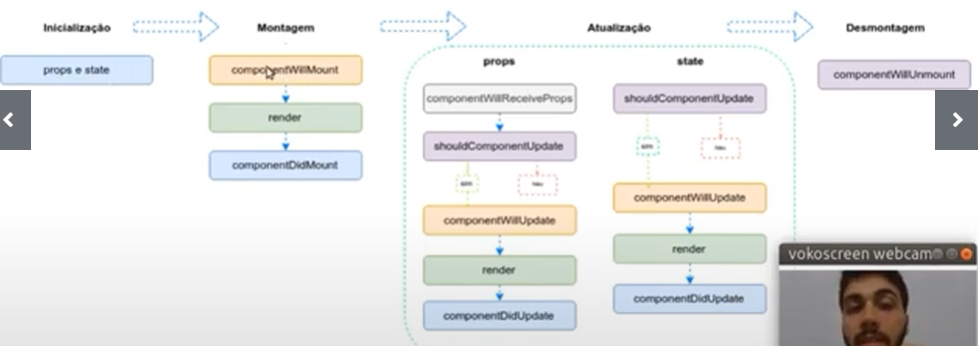

# História e Conceitos
React é uma **biblioteca** JavaScript para criar interfaces de usuário. Não é um framework!!

- Linguagem declarativa
- Pode ser utilizado em qualquer lugar (front-end, back-end, mobile, etc)
- Baseado em components


## O que é JSX

```Javascript
const element = <h1>Hello, World</h1>
```
Nem HTML e nem uma string!

React não separa as tecnologias colocando marcação em arquivos separados, e sim separa conceitos e mantém o código pouco acoplado chamando-os de componentes. Não é obrigatória a utilização do JSX

O browser não interpreta o JSX, para isso é necessário um transpilador para que a aplicação possa entender o código. O mais utilizado é o Babel

# Configuração
- React Create App
- React Scripts
- Task Runners e Bundler Sizers

```bash
npm init
npm install react react-dom react-scripts 
``` 

# Renderização
- Renderização de Elementos
- React DOM
- Nós Raiz

React "pensa" em como a interface deve estar a cada momento ao invés de alterá-la com o tempo, o que faz ter ganho de performance e evita uma série de erros

# Components e Props
- Função e Classe
- Props
- Composição de componentes
- Extração de componentes

# Estado e Ciclo de Vida

- Inicialização
- Montagem
- Atualização
- Desmontagem



Nenhum componente pai ou filho devem saber se outro componente possui estado ou não

O estado é apenas local ao componente e caso seja necessário enviar algum atributo para outro então é via props

# Ecossistema
- React Router
- Redux
- Material UI
- Ant-Design
- Storybook
- Gatsby
- Jest
- React i18n Next

---
---
---

# WebPack

## O que é webpack?
É um **module bundler** (um empacotador de módulos para aplicações JS)

Gerar bundler que será utilizado no HTML, em ES5

[Link Oficial](https://webpack.js.org)

Suporte:
- Fontes
- CSS
- Imagens
- HTML
- Javascript
- Plugins

## Configuração

### Principais conceitos do Webpack:
- Entry - Utilizando grafo, o webpack precisa de um ponto de entrada para buscar todos os módulos e dependências.
- Output - É para determinar quais são os bundlers que o webpack irá emitir
- Loaders - É para permitir que o webpack gerencie arquivos que não são javascript
- Plugins - Plugins podem ser utilizados para otimização de pacotes, minificação, injeção de scripts e muito mais
- Mode - Utilizados para abordagem de configuração zero. É possível configurar módulos como **production**, **development** ou **none**

    **Production** trás optimizações internas
    
    **Development** é executado com três grandes plugins: UgliflyJsPlugin, ModuleConcatenationPlugin e NoEmitOnErrorsPlugin

### Criação do arquivo webpack.config.js
``` JS
npm i -D webpack webpack-cli
"build": "webpack --mode production" //colocar dentro do package.json.scripts
npm i @babel/core babel-loader @babel/preset-env @babel/preset-react --save-dev
```

### Exemplo arquivo webpack.config.js
```JS
const path = require('path');

module.exports = {
    entry: './src/index.js',
    output: {
        path: path.resolve(__dirname, 'dist'),
        filename: 'bundle.js'
    },
    module: {
        rules: [
            {
                test: /\.(ks|jsx)$/,
                exclude: /node_modules/,
                use: {
                    loader: "babel-loader"
                }
            }
        ]
    }
}
```

### Exemplo arquivo .babelrc
```JSON
{
    "presets": [
        "@babel/preset-env",
        "@babel/present-react"
    ]
}
```