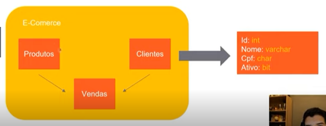

# O que é SQL Server?
## SGBDs
Softwares que padronizam banco de dados
### Tipos de banco de dados SGBDs
#### Relacionais - sistemas que precisam de uma confiabilidade muito grande dos seus dados, melhor garantia dos dados
- SQL Server
- Oracle
- MySQL

#### NoSQL - voltados para outros cenários (ex. melhor performance), armazenam grandes quantidades de dados sem muitos problemas
- MongoDB
- Neo4j
- Firebase

## Representação de um banco de dados relacional


- Linhas: registros
- Colunas: Informações daquele registro

### Atomicidade
Garantir que todos os dados estão corretos para colocar ele dentro de uma tabela

Exemplos:
- erro na venda de um produto para um cliente que não existe
- erro na venda para um cliente de um produto que não existe
- erro quando algum dado está com um tipo inválido

### Consistência dos dados
Espelhamento dos dados e segregar responsabilidades de banco de dados para melhorar a eficiência.


Garantir que os dados são iguais em todos os bancos

# Conceitos iniciais

## Tipos de dados

- int
- bigint
- float
- varchar (tamanho)
    "a"
- char (tamanho)
    "a         "
- bit
- datetime

## Comandos

### Criar base de dados
```SQL
create database Ecommerce
```

### Trocar de base de dados
``` SQL
use Ecommerce
```

### Criar tabela
``` SQL
create table Clientes
(
    Codigo int (50) null, -- indica que aceita nulos
    Nome varchar(200) not null, --indica que não aceita nulos
    TipoPessoa char(1) not null
)
```

### Remover tabela
``` SQL
drop table NomeTabela
```

### Adicionar Coluna
``` SQL
alter table clientes add DataCriacao datetime;
```

### Inserir linha
``` SQL
insert into clientes(nome, tipopessoa, codigo) values ('Joao', 'J', 20);
insert clientes(nome, tipopessoa, codigo) values ('Maria', 'F', 21);
insert clientes values(22, 'Paulo', 'F') (23, 'Fernanda', 'J'); --ordem dos argumentos será a ordem que a tabela possui
```

### Selecionar linha
``` SQL
select coluna1, coluna2, etc -- * para todas as colunas
from tabela
where condicao
```

### Atualizar linha
``` SQL
update  clientes
set     Codigo=7,
        Nome='José'
where tipopessoa = 'J'
```

### Remover linha
``` SQL
delete
from    clientes
-- excluir todos os registros

delete
from    clientes
where   Codigo in (5, 4, 3, 2)
-- excluir todos os clientes que possuiam um
-- código que estava entre os 4 citados

```

### Exemplo Select
``` SQL
select  *,
        case
            when TipoPessoa = 'J' then 'Jurídica'
            when TipoPessoa = 'F' then 'Física'
            else 'Pessoa indefinida'
        end
from    clientes;
-- com case

select  *, convert(varchar, datasolicitacao, formatacao*)
from    pedido;
-- com convert

insert  pedidoitemlog (codigopedido, codigoproduto, codigostatuspedidoitem, datamovimento)
select	CodigoPedido, CodigoProduto, 1, getdate()
from	pedidoitem
-- insert com select

```

## Operadores lógicos
- AND
- OR

# Normalizando dados
## Chaves primária e estrangeira
### Chave primária
É uma forma de identificar um registo, única para cada registro, melhora a perfomance na busca por indexar todos os registros
Ex.
- CPF
- ID
- Código

#### Definindo uma coluna como chave primária
``` SQL
alter table clientes add constraint pk_cliente primary key (codigo)
-- pk_cliente é o nome da regra que definimos
```

### Chave estrangeira
É uma chave que faz a relação de uma tabela com outra, sempre será uma cópia de uma chave primária de mesmo tipo e quantidade

#### Definindo uma coluna como chave estrangeira
``` SQL
alter table pedidoimte add constraint fk_pedido foreign key (codigopedido) references Pedido (codigo)
```

## Normalização

### Três Formas:
- Não deve haver um conjunto de colunas repetido ou um conjunto de informações em apenas uma propriedades.
    
    Ex: ao invés de criar uma coluna Endereço, separar as informações em outras colunas (CEP, Numero, Complemento, etc).
    
    Ex2: Duas colunas parecidas: Telefone-fixo e Telefone-celular, neste caso, o ideal é criar uma tabela de telefones e referenciar por chaves estrangeiras o cliente ou pessoa.
---
- Não pode possuir informações duplicadas que dependam da chave primária
---
- Colunas que se relacionam e uma delas possui valor único, devem ser separadas em uma tabela só com a coluna de valor único como chave primária. Outras tabelas que utilizam dela precisarão referenciar com chaves estrangeiras

# Trabalhando com  tabelas relacionadas

## Select com mais de uma tabela
- inner join -> Pega apenas os valores que atendem a condição   
- left join -> Pega todos os valores da tabela à direita. Se alguma linha da esquerda não corresponder à condicao, os valores da linha na tabela são null
- right join -> Semelhante à left join, a única diferença é que a prioridade é dada pela tabela à direita.

**Atenção! Utilizar filtros de condições dentro do "on", e não no when**


```SQL
    select  *
    from    clientes cli
    inner   tipojoin pedido ped
    on      cli.codigo = ped.codigocliente and ped.totalpedido > 10
```

# Alguns exemplos

``` SQL
select	cli.nome 'Cliente Nome',
		ped.totalpedido 'Total',
		case
			when cli.tipopessoa = 'F' then 'Física'
			else 'Jurídica'
		end TipoPessoa
from	clientes cli
left	join pedido ped
on		cli.codigo = ped.codigocliente 
and		ped.TotalPedido > 10
```
---
``` SQL
select	*
from	pedidoitem t1
inner	join pedidoitemlog t2
on		t1.codigopedido = t2.codigopedido
and		t1.codigoproduto = t2.codigoproduto
inner	join statuspedidoitem t3
on		t3.codigo = t2.codigostatuspedidoitem
```

---
``` SQL
select	sum(preco * quantidade) -- retorna a soma de todos as linhas
from	pedidoitem

select  avg(preco) -- retorna média 
from    pedidoitem

select  count() -- retorna quantidade de linhas
from    pedidoitem
```
---
``` SQL
select	t4.codigo,
		t4.descricao,
		sum(t1.preco * t1.quantidade) Somatoria
from	pedidoitem t1
inner	join pedidoitemlog t2
on		t1.codigopedido = t2.codigopedido
and		t1.codigoproduto = t2.codigoproduto
inner	join statuspedidoitem t3
on		t3.codigo = t2.codigostatuspedidoitem
inner	join produtos t4
on		t4.codigo = t2.codigoproduto
group   by t4.codigo,
		t4.descricao
--having  sum(t1.preco * t1.quantidade) > 10
order   by Somatoria desc
```
---
```SQL
select	*
from	clientes cli
left	join pedido ped
on		cli.codigo = ped.codigocliente
where	ped.codigo is null
```
---
```SQL
-- Conta quantos pedidos cada cliente fez
select  cli.codigo,
        cli.nome,
        count(ped.codigo)
from    clientes cli
left    join pedido ped
on      ped.codigocliente = cli.codigo
group   by cli.codigo,
        cli.nome
```